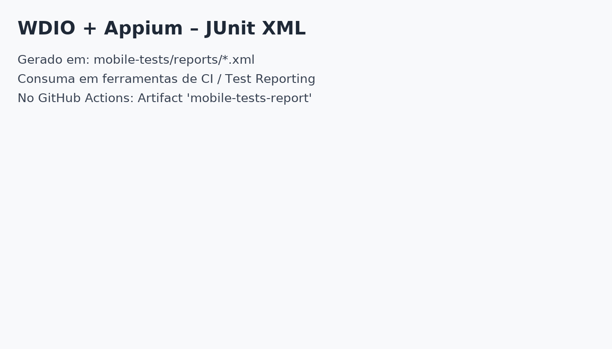
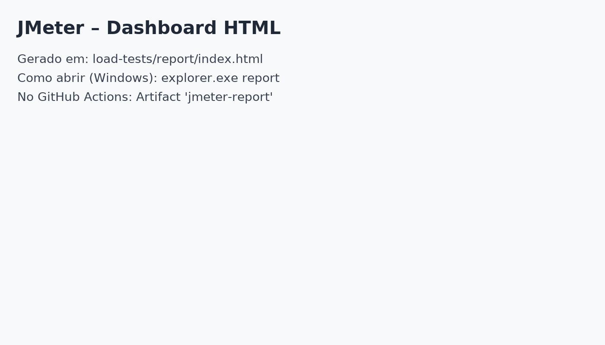

# QA Automation Assessment (Windows Guide + Reports)


Repositório de avaliação com **quatro frentes de teste** e **CI (GitHub Actions)**:
- **API** – Cypress (Mochawesome) → `api-tests/`
- **E2E Web** – Cypress + Cucumber (Mochawesome) → `e2e-tests/`
- **Mobile** – WebdriverIO + Appium
  - **Fake Driver (CI-friendly)** → `mobile-tests/` (default)
  - **Android real (APK com UiAutomator2)** → *config opcional* `wdio.android.cjs`
- **Carga** – JMeter (dashboard HTML) → `load-tests/`

---

## Sumário
- [Estrutura](#estrutura)
- [Pré-requisitos (Windows)](#pré-requisitos-windows)
- [Como rodar local (Windows)](#como-rodar-local-windows)
  - [1) API – Cypress](#1-api--cypress)
  - [2) E2E – Cypress + Cucumber](#2-e2e--cypress--cucumber)
  - [3) Mobile – WDIO + Appium](#3-mobile--wdio--appium)
    - [3A) Modo Fake Driver (sem emulador)](#3a-modo-fake-driver-sem-emulador)
    - [3B) Android real com APK (UiAutomator2)](#3b-android-real-com-apk-uiautomator2)
  - [4) Carga – JMeter](#4-carga--jmeter)
- [CI/CD – GitHub Actions](#cicd--github-actions)
- [Relatórios: prints e links](#relatórios-prints-e-links)
- [Soluções de problemas (Windows)](#soluções-de-problemas-windows)

---

## Estrutura
```
.
├── api-tests/                # Cypress para APIs (reqres.in)
├── e2e-tests/                # Cypress + Cucumber (SauceDemo)
├── mobile-tests/             # WDIO + Appium (Fake) e opcional Android real
├── load-tests/               # JMeter
└── .github/workflows/ci.yml  # Pipeline CI
```

---

## Pré-requisitos (Windows)

- **Node.js 18+** (recomendado 20) → `node -v`
- **Java 17+** (para Appium/JMeter) → `java -version`
- **Git**
- **Android (para APK emulador/dispositivo)**: Android Studio + SDK/Emulator/Platform-Tools
  - Abra **SDK Manager** e instale: *Android SDK Platform (API 30+), Build-Tools, Emulator, Platform-Tools*.
  - Crie um **AVD** (ex.: Pixel API 30) em **Device Manager**.
- **JMeter** (local opcional; o CI instala automaticamente)
  - Se quiser local: baixe o JMeter ou use `choco install jmeter` (se usar Chocolatey).

> **Dica CRLF/LF**: para evitar avisos de final de linha, adicione `.gitattributes` com `* text=auto` e normalize (`git add --renormalize .`).

---

## Como rodar local (Windows)

### 1) API – Cypress
```bash
cd api-tests
npm install
npx cypress run
# Relatórios: api-tests/cypress/reports/*.html
```

### 2) E2E – Cypress + Cucumber
```bash
cd e2e-tests
npm install
npx cypress run
# Relatórios: e2e-tests/cypress/reports/*.html
```

### 3) Mobile – WDIO + Appium

#### 3A) Modo Fake Driver (sem emulador)
> Útil para CI e para rodar sem Android/Emulador. **Opcional** no projeto.

1. (Uma vez) instalar o driver Fake:
```bash
cd mobile-tests
npm install
npx appium driver install --source=npm @appium/fake-driver@^5
```

2. Criar um app “fake” **XML** simples (se ainda não existe), ex.: `fake-app.xml` com um botão `login_button`.

3. Garantir que no `wdio.conf.cjs` a capability aponta para esse arquivo:
```js
'appium:app': path.join(process.cwd(), 'fake-app.xml')
```

4. Subir Appium (terminal 1):
```bash
cd mobile-tests
npx appium --log-level info --use-drivers=fake
```

5. Rodar WDIO (terminal 2):
```bash
cd mobile-tests
npx wdio run wdio.conf.cjs
# Relatórios: mobile-tests/reports/**
```

#### 3B) Android real com APK (UiAutomator2)
> Requer **Android Studio/SDK** + emulador ou dispositivo físico.  
> **Importante:** escolha **um** modo de Appium: ou você inicia **externo**, **ou** deixa o **WDIO service** iniciar. **Não use ambos ao mesmo tempo.**

1. Instalar o driver Android (UiAutomator2):
```bash
cd mobile-tests
npx appium driver install uiautomator2@latest
```

2. Colocar seu `.apk` em `mobile-tests/app/app-under-test.apk`
  - Ex.: `mobile-tests/app/demo.apk`

3. Ajustar `wdio.conf.cjs` (escolha **A** ou **B**):

**A) Usando Appium externo (recomendado para Appium Inspector)**  
No `wdio.conf.cjs`, conecte no servidor externo e **não** use o service:
```js
// wdio.conf.cjs (trecho)
exports.config = {
  runner: 'local',
  hostname: '127.0.0.1',
  port: 4725,
  path: '/',
  services: [], // não iniciar Appium via service
  capabilities: [{
    platformName: 'Android',
    'appium:automationName': 'UiAutomator2',
    'appium:deviceName': 'Android Emulator',
    'appium:app': require('path').resolve(__dirname, 'app', 'app-under-test.apk'),
    'appium:noReset': true,
    'appium:newCommandTimeout': 240
    // Se usar device físico:
    // 'appium:udid': '<serial-ou-emulator-5554>'
  }],
  // ...
}
```

**B) Deixando o WDIO iniciar o Appium (service)**  
No `wdio.conf.cjs`, habilite o service e **não** suba Appium externamente:
```js
// wdio.conf.cjs (trecho)
exports.config = {
  runner: 'local',
  services: [[
    'appium',
    { args: { address: '127.0.0.1', port: 4723, basePath: '/', relaxedSecurity: true, logLevel: 'warn' } }
  ]],
  capabilities: [{
    platformName: 'Android',
    'appium:automationName': 'UiAutomator2',
    'appium:deviceName': 'Android Emulator',
    'appium:app': require('path').resolve(__dirname, 'app', 'app-under-test.apk'),
    'appium:noReset': true,
    'appium:newCommandTimeout': 240
  }],
  // ...
}
```

4. Iniciar **emulador** ou **conectar device**  
   Garanta que o `adb` enxerga um dispositivo como `device`:
```bash
adb devices
# deve listar: emulator-5554    device
```
Exemplo de boot do emulador:
```bash
emulator -avd Pixel_5_API_30 -no-snapshot-load -gpu swiftshader_indirect -no-boot-anim -noaudio -ports 5554,5555
adb wait-for-device
adb shell 'while [[ $(getprop sys.boot_completed) != "1" ]]; do sleep 1; done'
adb shell input keyevent 82
adb devices
```

5. Subir Appium (apenas se escolheu **3B-A Appium externo**):
```bash
npx appium --address 127.0.0.1 --port 4725 --base-path / --relaxed-security
# Se for usar o Inspector no browser, acrescente: --allow-cors
```

6. Rodar testes Android:
```bash
cd mobile-tests
npx wdio run wdio.conf.cjs
# Rodar um spec específico:
npx wdio run wdio.conf.cjs --spec test/specs/forms.e2e.js
# Relatórios: mobile-tests/reports/**
```

> Dica (opcional – Appium Inspector): com Appium **externo** ligado, use as capabilities mínimas no Inspector:
> ```json
> {
>   "platformName": "Android",
>   "appium:automationName": "UiAutomator2",
>   "appium:deviceName": "Android Emulator",
>   "appium:udid": "emulator-5554",
>   "appium:noReset": true,
>   "appium:newCommandTimeout": 240
>   // Para instalar APK via Inspector:
>   // "appium:app": "C:\\caminho\\para\\app-under-test.apk"
> }
> ```


### 4) Carga – JMeter
```bash
cd load-tests
# Se JMeter estiver instalado no PATH:
jmeter -n -t jmeter-test-plan.jmx -l results.jtl -e -o report
# Abra: load-tests/report/index.html
```

---

## CI/CD – GitHub Actions

O pipeline (`.github/workflows/ci.yml`) roda em **push** e **pull_request** com 4 jobs paralelos:
- **api_tests** → Cypress API (Mochawesome)
- **e2e_tests** → Cypress + Cucumber (Mochawesome)
- **mobile_tests** → WDIO + Appium Fake (JUnit)
- **load_tests** → JMeter (HTML dashboard)

**Artifacts gerados** por job:
- `api-tests-report` → `api-tests/cypress/reports/*.html`
- `e2e-tests-report` → `e2e-tests/cypress/reports/*.html`
- `mobile-tests-report` → `mobile-tests/reports/*.xml`
- `jmeter-report` → `load-tests/report/*`

Para baixar: **Aba Actions → execução → Artifacts** (canto direito).

---

## Relatórios: prints e links

### Cypress API (Mochawesome)
- Caminho local: `api-tests/cypress/reports/`
- Exemplo de abertura (Windows):
  ```bash
  cd api-tests && explorer.exe cypress\reports
  ```


### Cypress E2E (Mochawesome)
- Caminho local: `e2e-tests/cypress/reports/`
- Abertura:
  ```bash
  cd e2e-tests && explorer.exe cypress\reports
  ```


### WDIO + Appium (JUnit)
- Caminho local: `mobile-tests/reports/*.xml`
- Consuma esses XMLs em dashboards de testes/CI.


### JMeter (Dashboard HTML)
- Caminho local: `load-tests/report/index.html`
- Abertura:
  ```bash
  cd load-tests && explorer.exe report
  ```


> **Dica:** Você pode substituir as *prints* acima por **screenshots reais** após a primeira execução, mantendo os nomes em `docs/` para o README exibi-las automaticamente.

---

## Soluções de problemas (Windows)

- **LF vs CRLF**: Avisos “LF will be replaced by CRLF” → não é erro. Sugestão: adicione `.gitattributes` com `* text=auto` e normalize (`git add --renormalize .`).
- **`npm ci` falha (sem lockfile)**: use `npm install` na primeira vez para gerar `package-lock.json`. Depois, no CI, `npm ci`.
- **Cypress ESM: `require is not defined`**: use `import ... from 'cypress-mochawesome-reporter/plugin.js'` nos `cypress.config.js`.
- **Appium Fake: `app can't be blank`**: a capability `appium:app` é obrigatória; aponte para um arquivo **XML** válido (ex.: `fake-app.xml`).
- **`ECONNREFUSED 127.0.0.1:4723`**: o servidor Appium não está ativo; rode `npx appium ...` antes do WDIO.
- **Android Emulator**: ative Virtualization na BIOS e **Windows Hypervisor Platform**; inicie o AVD pelo **Device Manager**. Valide com `adb devices`.
- **JMeter**: se `jmeter` não estiver no PATH, instale localmente ou rode via CI (o Actions já instala).

---

### Contatos / Créditos
- Stack: Cypress 13, Cucumber Preprocessor, Mochawesome, WDIO 9, Appium 2, JMeter 5.6.
- Pipeline: GitHub Actions com 4 jobs e artifacts.

Happy testing! 🚀