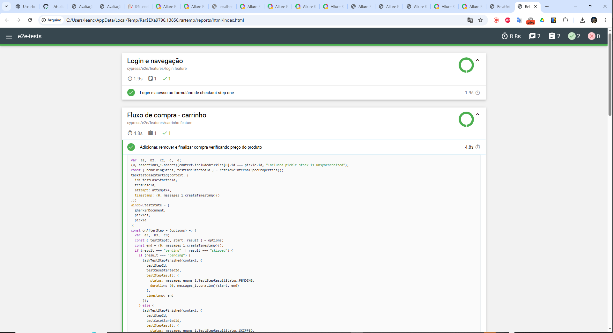

# QA Automation Assessment (Windows Guide + Reports)


Repositório de avaliação com **quatro frentes de teste** e **CI (GitHub Actions)**:
- **API** – Cypress (Mochawesome) → `api-tests/`
- **E2E Web** – Cypress + Cucumber (Mochawesome) → `e2e-tests/`
- **Mobile** – WebdriverIO + Appium **(+ Allure)**
  - **Android real (APK com UiAutomator2)** → `mobile-tests/` (padrão)
  - **Fake Driver (CI-friendly)** → habilite com `USE_FAKE=1`
- **Carga** – JMeter (dashboard HTML) → `load-tests/`

---

## Sumário
- [Estrutura](#estrutura)
- [Pré-requisitos (Windows)](#pré-requisitos-windows)
- [Como rodar local (Windows)](#como-rodar-local-windows)
  - [1) API – Cypress](#1-api--cypress)
  - [2) E2E – Cypress + Cucumber](#2-e2e--cypress--cucumber)
  - [3) Mobile – WDIO + Appium](#3-mobile--wdio--appium)
    - [3A) Android real com APK (UiAutomator2)](#3a-android-real-com-apk-uiautomator2)
    - [3B) Modo Fake Driver (sem emulador)](#3b-modo-fake-driver-sem-emulador)
  - [4) Carga – JMeter](#4-carga--jmeter)
- [CI/CD – GitHub Actions](#cicd--github-actions)
- [Relatórios: prints e links](#relatórios-prints-e-links)
- [Soluções de problemas (Windows)](#soluções-de-problemas-windows)

---

## Estrutura
```
.
├── api-tests/                # Cypress para APIs (reqres.in)
├── e2e-tests/                # Cypress + Cucumber (SauceDemo)
├── mobile-tests/             # WDIO + Appium (Android real ou Fake Driver) + Allure
├── load-tests/               # JMeter
└── .github/workflows/ci.yml  # Pipeline CI
```

---

## Pré-requisitos (Windows)

- **Node.js 18+** (recomendado 20 ou 22) → `node -v`
- **Java 17+** (para Appium/JMeter) → `java -version`
- **Git**
- **Android (para APK em emulador/dispositivo)**: Android Studio + SDK/Emulator/Platform-Tools
  - Abra **SDK Manager** e instale: *Android SDK Platform (API 30+), Build-Tools, Emulator, Platform-Tools*.
  - Crie um **AVD** (ex.: Pixel API 30) em **Device Manager**.
- **Allure** (CLI via `npx allure`, já referenciado nos comandos)
- **JMeter** (local opcional; o CI instala automaticamente)
  - Se quiser local: baixe o JMeter ou use `choco install jmeter` (se usar Chocolatey).

> **Dica CRLF/LF**: para evitar avisos de final de linha, adicione `.gitattributes` com `* text=auto` e normalize (`git add --renormalize .`).

---

## Como rodar local (Windows)

### 1) API – Cypress
```bash
cd api-tests
npm install
npx cypress run

## Relatórios: api-tests/cypress/reports/*.html
```

### 2) E2E – Cypress + Cucumber
```bash
cd e2e-tests
npm install
npx cypress run
## Relatórios: e2e-tests/cypress/reports/*.html
```

### 3) Mobile – WDIO + Appium

#### 3A) Android real com APK (UiAutomator2)
> Requer **Android Studio/SDK** + emulador ou dispositivo físico.

1) **APK do app**: coloque em `mobile-tests/app/demo.apk` (ou aponte outro caminho via `ANDROID_APP`).  
2) **Device**: inicie emulador ou plugue um device e confira:
```bash
adb devices
## deve listar ao menos 1 "device"
```
3) **Suba o Appium** (opção manual – caso não queira que o serviço do WDIO gerencie):
```bash
cd mobile-tests
npx appium --address 127.0.0.1 --port 4725 --base-path / --relaxed-security --allow-cors --log-level info --use-drivers uiautomator2
```
4) **Execute os testes** (todos os specs):
```bash
cd mobile-tests
npm install
npx wdio run wdio.conf.ts
```
   **Apenas um arquivo**:
```bash
npx wdio run wdio.conf.ts --spec test/specs/login.e2e.js
```

> **APK customizado**: informe via env antes do comando do WDIO:  
> `set ANDROID_APP=C:\caminho\seu.apk` (PowerShell) ou `export ANDROID_APP=/abs/path/seu.apk` (macOS/Linux).

#### 3B) Modo Fake Driver (sem emulador)
> Útil para CI e para rodar sem Android/Emulador.

1) (Uma vez) instalar o Fake Driver:
```bash
cd mobile-tests
npx appium driver install --source=npm @appium/fake-driver@^5
```
2) **App fake (XML)**: deixe um arquivo simples (ex.: `fake-app.xml`).  
3) **Rodar com Fake** (Appium manual, se quiser ver logs):
```bash
npx appium --address 127.0.0.1 --port 4725 --base-path / --relaxed-security --allow-cors --log-level info --use-drivers fake
```
4) **Executar WDIO usando Fake**:
```bash
USE_FAKE=1 npx wdio run wdio.conf.ts
```

> Dica: o serviço do WDIO também consegue subir o Appium automaticamente; o manual acima é opcional.

#### Allure – Gerar & Abrir (Mobile)
Após rodar os testes mobile:
```bash
## Gera HTML em ./allure-report a partir de ./allure-results
npx allure generate --clean --output allure-report allure-results

## Abre no navegador
npx allure open ./allure-report
```

### 4) Carga – JMeter
```bash
cd load-tests
## Se JMeter estiver instalado no PATH:
jmeter -n -t jmeter-test-plan.jmx -l results.jtl -e -o report
## Abra: load-tests/report/index.html
```

---

## CI/CD – GitHub Actions

O pipeline (`.github/workflows/ci.yml`) roda em **push** e **pull_request** com 4 jobs paralelos:
- **api_tests** → Cypress API (Mochawesome)
- **e2e_tests** → Cypress + Cucumber (Mochawesome)
- **mobile_tests** → WDIO + Appium **Fake Driver** no CI (**Allure**)
- **load_tests** → JMeter (HTML dashboard)

**Artifacts gerados** por job:
- `api-tests-report` → `api-tests/cypress/reports/*.html`
- `e2e-tests-report` → `e2e-tests/cypress/reports/*.html`
- `mobile-allure-results` → `mobile-tests/allure-results/*`
- `mobile-allure-report` → `mobile-tests/allure-report/*`
- `jmeter-report` → `load-tests/report/*`

Para baixar: **Aba Actions → execução → Artifacts** (canto direito).

---

## Relatórios: prints e links

### Cypress API (Mochawesome)
- Caminho local: `api-tests/cypress/reports/`
- Exemplo de abertura (Windows):
  ```bash
  cd api-tests && explorer.exe cypress\reports
  ```


### Cypress E2E (Mochawesome)
- Caminho local: `e2e-tests/cypress/reports/`
- Abertura:
  ```bash
  cd e2e-tests && explorer.exe cypress\reports
  ```


### WDIO + Appium (Allure)
- **Resultados brutos**: `mobile-tests/allure-results/*`
- **HTML**: `mobile-tests/allure-report/index.html`
- Abertura:
  ```bash
  cd mobile-tests
  npx allure open ./allure-report
  ```


### JMeter (Dashboard HTML)
- Caminho local: `load-tests/report/index.html`
- Abertura:
  ```bash
  cd load-tests && explorer.exe report
  ```


> **Dica:** Você pode substituir as *prints* acima por **screenshots reais** após a primeira execução, mantendo os nomes em `docs/` para o README exibi-las automaticamente.

---

## Soluções de problemas (Windows)

- **LF vs CRLF**: Avisos “LF will be replaced by CRLF” → não é erro. Sugestão: `.gitattributes` com `* text=auto` e normalize (`git add --renormalize .`).
- **`npm ci` falha (sem lockfile)**: use `npm install` na primeira vez para gerar `package-lock.json`. Depois, no CI, `npm ci`.
- **Cypress ESM: `require is not defined`**: usar `import ... from 'cypress-mochawesome-reporter/plugin.js'` no `cypress.config.js`.
- **Appium Fake: `app can't be blank`**: a capability `appium:app` é obrigatória no Fake Driver; aponte para um arquivo **XML** (ex.: `fake-app.xml`).
- **`ECONNREFUSED 127.0.0.1:4725`**: o servidor Appium não está ativo; rode `npx appium ...` antes do WDIO ou deixe o serviço do WDIO subir.
- **`Could not find a connected Android device`**: inicie um AVD via **Device Manager** ou plugue um phone com **USB debugging**. Verifique `adb devices`.
- **Porta ocupada (EADDRINUSE)**: libere a porta 4725. No PowerShell admin:  
  `Get-Process -Id (Get-NetTCPConnection -LocalPort 4725 -State Listen).OwningProcess | Stop-Process -Force`
- **Build lento/timeout**: aumente `newCommandTimeout/adbExecTimeout/uiautomator2Server*Timeout` nas capabilities (`wdio.conf.ts`).

---

### Contatos / Créditos
- Stack: Cypress 13, Cucumber Preprocessor, Mochawesome, WDIO 9, Appium 2, Allure, JMeter 5.6.
- Pipeline: GitHub Actions com 4 jobs e artifacts..
